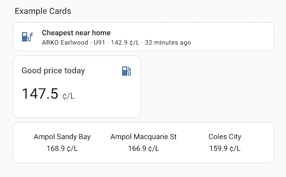

<p align="center">
  <a href="https://github.com/custom-components/hacs"></a>
  
</p>

# NSW Fuel Check Integration

Integration allowing fuel prices to be included in Home Assistant dashboards.

## Feedback
Feedback, issues and feature requests are welcome and can be made [here](https://github.com/bicycleboy/nsw_tas_fuel_station/issues).

## Features
- Allows users to include NSW, ACT and Tasmanian fuel prices into their home assistant dashboards and automations.  Currently only these Australian states are supported as other states offer different APIs.
- This 2026 update to the existing core integration allows the user to configure the integration via the user interface (vs configuration.yaml) and adds a "cheapest today" sensor.

## Example Cards for Your Home Assistant Dashboard



[Example card yaml](https://github.com/bicycleboy/nsw_tas_fuel_station/blob/main/example_cards.yaml)

## User Guide
This [user guide](./nsw_fuel_station.md) highlights the functionality and explains how to configure the integration once installed.

## Sensors Created
- Sensors for favorite fuel station(s) grouped by nickname/location e.g. home, work.
- Sensors for cheapest fuel near nickname/location.

## Installation
This integration is currently available as a [HACS](https://www.hacs.xyz/docs/use) custom integration. (It does, however, pass the automated quality checks for a core integration.) If you are new to HACS don't panic, it is in widespread use.

### HACS Installation

If you don't already have it, install [HACS](https://www.hacs.xyz/docs/use/) then follow the [guide for installing custom repositories](https://hacs.xyz/docs/faq/custom_repositories/). In the repository field enter the address of this git repository "github.com/bicycleboy/nsw_tas_fuel_station".

### Manual Installation

A manual installation involves simply copying a few python files into your Home Assistant config/custom_components directory. You will need familiarity with the command line and one of the Apps that provide access to the commandline such as [terminal](https://github.com/home-assistant/addons/tree/master/ssh).

```
cd /tmp

git clone https://github.com/bicycleboy/nsw_tas_fuel_station.git

cd /config/custom_components

mv /tmp/nsw_fuel_station/custom_components/nsw_fuel_station.
```

You can of course inspect the files if you are concerned about anything.

Re-start Home Assistant.

## Removing the existing NSW Fuel Station Integration

If you already have the NSW Fuel Station core integration delete the sensor configuration from configuration.yaml (ie using File Viewer) and then reboot home assistant.  Delete lines that look like this:
```
sensor:
  - platform: nsw_fuel_station
    station_id: 18798
  - platform: nsw_fuel_station
    station_id: 18813
```
Sensor names will be similar but with a new prefix so dashboard cards will need updating.

## Removing the integration
Remove the integration in the standard way from:
Settings -> Devices and Services -> Select NSW Fuel Check Integration -> three dots -> Delete.
Delete cards from dashboards for all users.
Reboot home assistant.

## Repository Overview
This repository contains:

File | Purpose | Documentation
-- | -- | --
`.github/ISSUE_TEMPLATE` | Templates for the issue tracker | [Documentation](https://help.github.com/en/github/building-a-strong-community/configuring-issue-templates-for-your-repository)
`custom_components/nsw_tas_fuel_check/*.py` | Integration files required in your installation. |
`LICENSE` | The license file for the project. | [Documentation](https://help.github.com/en/github/creating-cloning-and-archiving-repositories/licensing-a-repository)
`pyproject.toml` | Python setup and configuration for this integration. | [Documentation](https://packaging.python.org/en/latest/guides/writing-pyproject-toml/)
`tests/*.py` | Unit test files for each .py file without calling any real APIs. |
`README.md` | The file you are reading now. | [Documentation](https://help.github.com/en/github/writing-on-github/basic-writing-and-formatting-syntax)
`nsw_fuel_station.md` | User Guide. | [Documentation](https://help.github.com/en/github/writing-on-github/basic-writing-and-formatting-syntax)

## Debugging
To assist with any issues, or determine if the API is returning unexpected results or there is a bug, you can turn on debugging in your configuration.yaml.

```
logger:
  logs:
    custom_components.nsw_tas_fuel_station: debug
    nsw_tas_fuel: debug
```

## Contributing
Contributions and feedback welcome, please visit https://github.com/bicycleboy/nsw_tas_fuel_station, select **Issues** and choose either bug report or feature request.

## Licence
This software is licensed under the MIT License. See the [LICENCE](https://github.com/bicycleboy/nsw_tas_fuel_ui/LICENCE) file for details.

