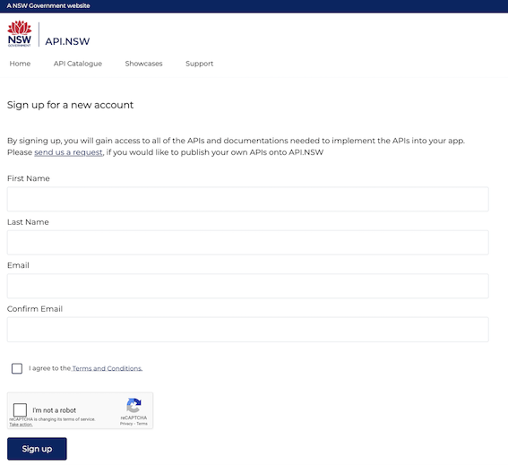
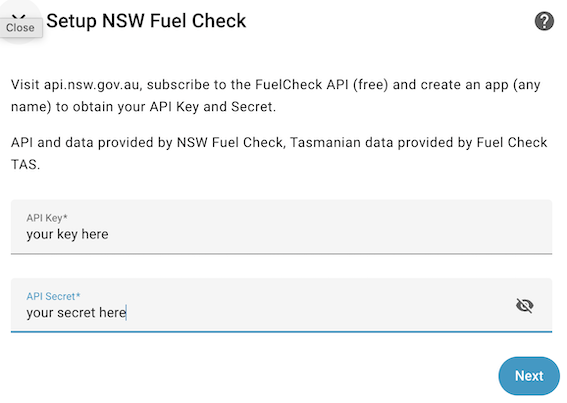
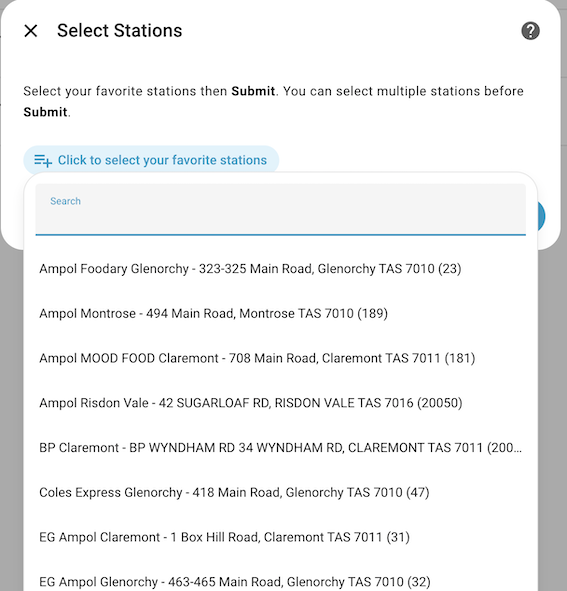
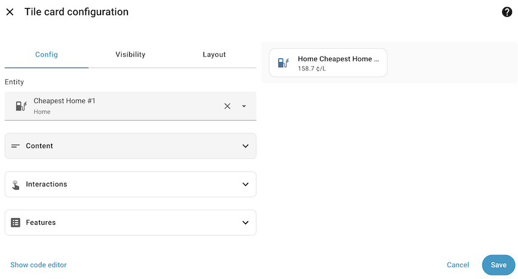
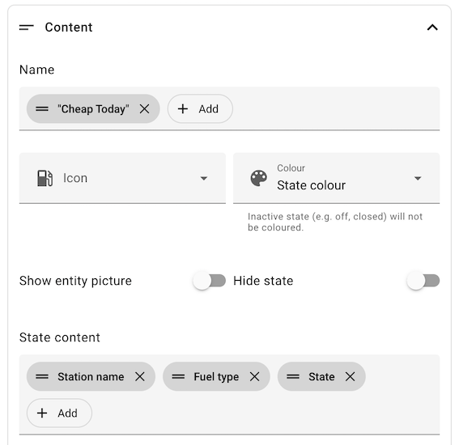
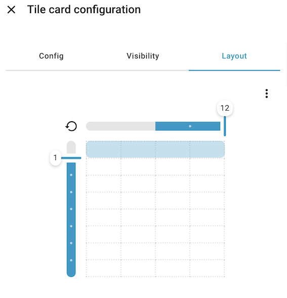

<!-----
title: NSW Fuel Check
description: Integration for the New South Wales Fuel Check API
ha_release: 2026.5
ha_iot_class: Cloud Polling
ha_codeowners:
  - '@bicycleboy'
ha_domain: nsw_fuel_station
ha_integration_type: hub
related:
  - url: https://github.com/bicycleboy/nsw_fuel_tas_station
    title: Integration Source
  - url: https://https://github.com/bicycleboy/nsw-fuel-api-client
    title: API Client Source
---
-->

The **NSW Fuel Check** integration is used to integrate with the NSW Government API for Fuel Prices.

This integration only supports Australian states NSW and Tasmania.

Like weather integrations, the idea is not to replace the NSW Fuel Check App but give you a glance at prices as you visit your home assistant dashboard.


## Prerequisites

1. Live or travel in NSW or Tasmania.
2. Visit api.nsw.gov.au.
3. Subscribe to the FuelCheck API and create an app to obtain your API Key and Secret. Signup is free. The site requires an email addreess but does not spam you.  When prompted to create and name your app it can have any name.  Make a note of the API Key and API Secret.



4. If you already have the NSW Fuel Station core integration delete the sensor configuration from configuration.yaml (ie using File Viewer) and then reboot home assistant.  Delete lines that look like this:
```
sensor:
  - platform: nsw_fuel_station
    station_id: 18798
  - platform: nsw_fuel_station
    station_id: 18813
```
Sensor names will remain the same so there should be no need to delete dashboard cards. 

## Installation
Currently this is a custom integrtation, see [the readme](./README.md) for installation details.

## Configuration - Home Zone

On the setup screen, enter your credentials.



Once you have validated your key and secret you will be prompted to select fuel stations from the list of stations near your home zone.



Select one or more stations.

Sensors will be created for each station you select.  In NSW a sensor will be created for Ethanol E10 and another sensor for Unleaded U91. You can disable sensors not available or not of interest to you.  In Tasmania by default only an Unleaded U91 sensor is created.

Click Submit.

## Adding Sensors to Your Dashboad

### Selected Stations

Configure your dashboard cards as normal, the sensors will have names like "BP Rosedale U91", starting with the brand name. As station names can be long, you may want to configure a short custom name in cards that support it.

### Cheapest Stations

Two additional sensors will be created:

- Cheapest Home #1
- Cheapest Home #2

The NSW Fuel Check API returns a balance between cheapest fuel and distance from your home zone. For NSW the integration looks for the lowest U91 and E10 prices.



The **tile card** is a good choice for the cheapest sensors as the tile card provides access to the additional attributes of these sensors.  In the tile card configuration under the **Content - State Content** heading, use the **Add** button to add **Station name**, **Fuel type**, and **State**.  You may want to include Last Changed.



Since station names are often long you may wish to make the tile card full width.



The sensor card and glance card may also suit your dashboard, note that not all cards currently support additional attributes.


## Configuration - Advanced options

When first presented with the select stations screen you can choose **"Find more stations..."** then **Submit** to enter the Advanced Selection screen.   Here you can select the following options:


Location Nickname:

A name to group your sensors under.  For example Home or Work.  Accept the default or pick a name you like. For each nickname you configure the integration will create sensors named "Cheapest \[*nickname*\] #1" and "Cheapest \[*nickname*\] #2".  The idea is that in your dashboard you can at a glance see if it is cheaper to fill up at home or at work (or wherever).

Location:

description: Use the location selector to choose another location.

Fuel Type:

Pick a fuel type to see a list of stations stocking that fuel type.


On Submit you will return to the Select Stations screen where there will be a list of stations for the location you entered or which carry the fuel you selected.

If you leave the Home nickname in the nickname field or enter another existing nickname sensors for additional stations or additional fuel types can be added to that nickname.

You can change the location associated with an existing nickname, for example to group stations under "trip to work", however, currently only the last location set will be used for the "Cheapest \[*nickname*\] #1/2" sensors.


## Data updates

The **NSW Fuel Check** integration term polling polls data from the API twiced a day by default.

## Known limitations

The integration currently only supports New South Wales and Tasmania (Australia).
Some fuel types such as EV can be selected but currently do not return any data.
Selecting less common fuel types may produce unexpected results, e.g. NSW stations included in Tasmania.

## Troubleshooting

### I cannot see the station with the cheapest price

#### Description

Most lovelace cards do not support the required additional attributes.

#### Resolution

Use a tile card as described under **Cheapest Stations** above.

### My E10 sensor is unavailable

#### Description

The integration currently assumes all NSW stations stock E10 and all stations stock U91.

#### Resolution

If a sensor consistently shows as unavailable you can disable the sensor using [Settings > Devices & services > Entities ](https://www.home-assistant.io/docs/configuration/customizing-devices/).