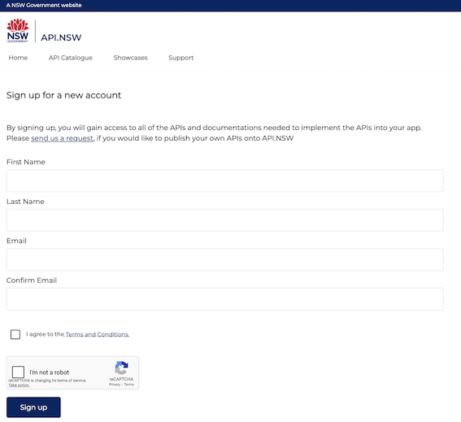
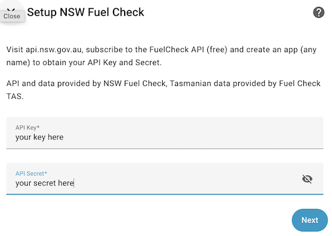
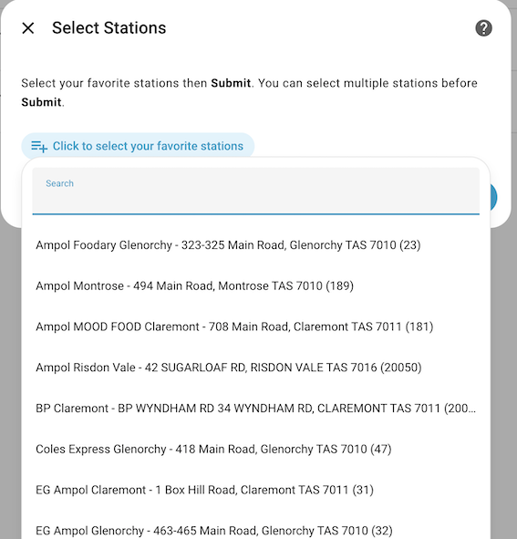
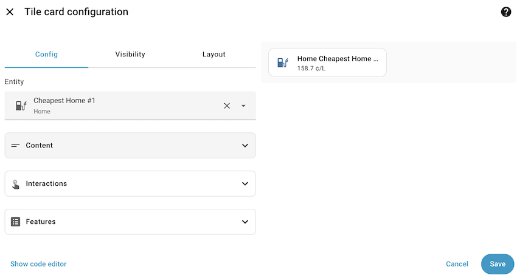
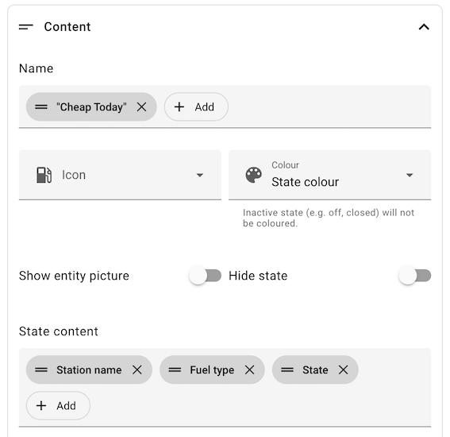
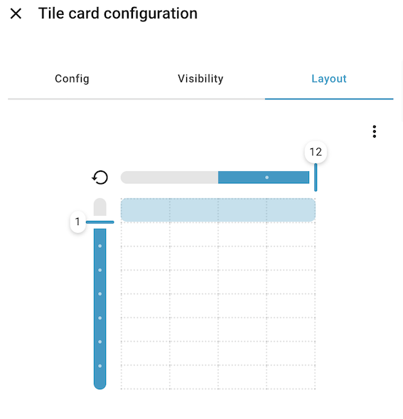
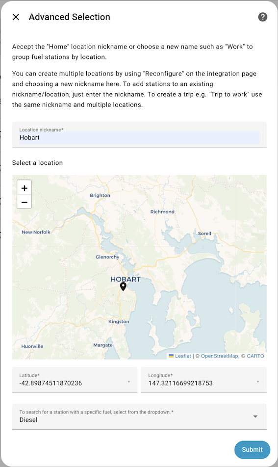
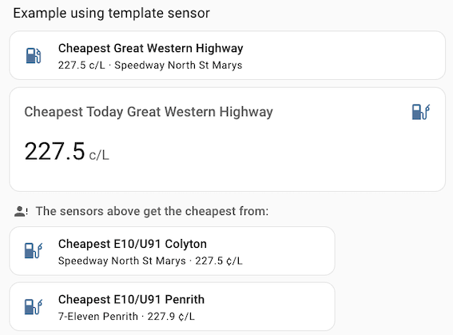

<!-----
title: NSW Fuel Check
description: Integration for the New South Wales Fuel Check API
ha_release: 2026.5
ha_iot_class: Cloud Polling
ha_codeowners:
  - '@bicycleboy'
ha_domain: nsw_tas_fuel_station
ha_integration_type: hub
related:
  - url: https://github.com/bicycleboy/nsw_fuel_tas_station
    title: Integration Source
  - url: https://https://github.com/bicycleboy/nsw-fuel-api-client
    title: API Client Source
---
-->

The **NSW Fuel Check** integration is used to integrate with the NSW Government API for Fuel Prices using official mandatory reporting data from NSW Fuel Check and FuelCheck - TAS.

This integration only supports Australian states NSW, the ACT and Tasmania.

Like weather integrations, the idea is not to replace the NSW Fuel Check App but give you a glance at prices as you visit your home assistant dashboard.


# Prerequisites

1. Live or travel in NSW, the ACT or Tasmania.
2. Visit api.nsw.gov.au.
3. Subscribe to the FuelCheck API and create an app to obtain your API Key and Secret. Signup is free. The site requires an email address but does not spam you.  When prompted to create and name your app it can have any name.  Make a note of the API Key and API Secret.



# Installation
Currently this is a custom integration, see [the readme](./README.md) for installation details.

# Configuration

## Home Zone

On the setup screen, enter your credentials.



Once you have validated your key and secret you will be prompted to select fuel stations from the list of stations near your home zone. These "favorite" stations assume we are creatures of habit and typically fill up at stations that are often the cheapest near us.



Select around 1 - 4 stations, more is hard to display neatly on a dashboard.  Also be aware the API does have rate limits if you choose 10's of stations.

Sensors will be created for each station you select.  In NSW and the ACT the default search is for Ethanol E10 and Unleaded U91. In Tasmania by default search is for Unleaded U91.

Click Submit.

## Adding Sensors to Your Dashboard

#### Selected Stations

Configure your dashboard cards as normal, the sensors will have names like "BP Rosedale U91", starting with the brand name. As station names can be long, you may want to configure a short custom name in cards that support it.

#### Cheapest Stations

Two additional sensors will be created:

- Cheapest Home #1
- Cheapest Home #2

The NSW Fuel Check API returns a balance between cheapest fuel and distance from your home zone. For NSW the integration looks for the lowest of U91 and E10 prices.



The **tile card** is a good choice for the cheapest sensors as the tile card provides access to the additional attributes of these sensors.  In the tile card configuration under the **Content - State Content** heading, use the **Add** button to add **Station name**, **Fuel type**, and **State**.  You may want to include Last Changed which is when the API reports the fuel price was last updated.



Since station names are often long you may wish to make the tile card full width.



The sensor card and glance card may also suit your dashboard, note that not all cards currently support additional attributes.


## Advanced options / Reconfigure

Having created sensors for near your home, on the integration page you can use the **Reconfigure** option to enter the advanced configuration.   Here you can select the following options:


Location Nickname:

A name to group your sensors under.  For example "Home" or "Work".  Accept the default or pick a name you like. For each nickname you configure, the integration will create sensors named "Cheapest \[*nickname*\] #1" and "Cheapest \[*nickname*\] #2".  The idea is that in your dashboard you can at a glance see if it is cheaper to fill up at home or at work (or wherever).

Location:

Use the location selector to choose another location.  For example if you have changed the nickname to "Work" change the location accordingly.  You can also change the location for an existing nickname such as "Home" if you want a sensor for a station that is not currently listed.

Fuel Type:

Pick a fuel type to see a list of stations stocking that fuel type.  If, for example you only care about Diesel, you can create Diesel sensors and disable other sensors.



On Submit you will return to the Select Stations screen where there will be a list of stations for the location you entered and/or which carry the fuel you selected.

You can add fuel types to an existing station.

You can also add stations to an existing nickname.

You can change the location associated with an existing nickname, for example to group stations under "trip to work", however, currently only the last location set will be used for the "Cheapest \[*nickname*\] #1/2" sensors (see also troubleshooting).


# Data updates

The **NSW Fuel Check** integration polls data from the API twiced a day by default.

# Known limitations

The integration currently only supports New South Wales, the ACT and Tasmania (Australia).

The cheapest sensor currently only supports E10/U91, for other fuels see troubleshooting.

Some fuel types such as EV can be selected but currently do not return any data.

Selecting less common fuel types may produce unexpected results, e.g. NSW stations included in Tasmania.

# Troubleshooting

## I cannot see the station name with the cheapest price, only "Cheapest Home 1"

#### Description

Most lovelace cards do not support the required additional attributes which hold the station name.

#### Resolution

Use a tile card as described under **Cheapest Stations** above.

## My Cheapest Home 2 sensor is unavailable

#### Description

No price is shown, only unavailable for the 2nd cheapest sensor.

#### Resolution

In some locations the NSW Fuel Check API may only return 1 station.  Try changing the location for the nickname repeatedly until you get a useful list of stations, these will likely be the stations that are "surveyed" for the cheapest fuel.

If a sensor consistently shows as unavailable you can disable the sensor using [Settings > Devices & services > Entities ](https://www.home-assistant.io/docs/configuration/customizing-devices/).

## I only see one station / I am not seeing the stations I expected in the select stations list

#### Description

Your stations list is missing stations you expected to see.

#### Resolution

This can be for a number of reasons. For example you searched to U91 but the station does not stock U91. Use **Reconfigure** and try different fuel types and locations. Try using different locations and radius settings to get all the stations you want. If you are still not seeing what you want, see "I want to know the cheapest price close to my usual routes" below. You can also turn on debugging as described in [the readme](./README.md) and check the logs for errors and details of the parameters sent to NSW Fuel Check.

## I just want 1 cheapest sensor / I want a sensor to cover my entire trip to work but only close to my route

#### Description

I want to know the cheapest price close to my usual routes, without cluttering my dashboard with many cards.

#### Resolution (Advanced)

1. This solution requires comfort with editing configuration.yaml.
2. Use the **Reconfigue** option with a small, say 5Km, radius to create multiple nicknames along your route(s).  Select just 1 station.
3. Edit your configuration.yaml and create a template sensor similar to [this example](./example_template_sensor.yaml).  You will of course need to change the sensor names to match yours or get your favorite AI to do it for you.
4. Restart HA.
5. Add the template sensor to your dashboard.  You can find example cards like the below using the template sensor [here](./example_card_template_sensor.yaml).
6. You may wish to disable any station entities created if you are not using them on your dashboard to avoid API rate limits.



## I am a Diesel/Premiun Petrol user, how do I find the cheapest?

#### Description

Currently the cheapest sensors only offer E10/U91.

#### Resolution (Advanced)

1. This is a workaround which requires comfort with editing configuration.yaml.  Unlike the E10/U91 cheapest sensors which use the API to find the cheapest stations by location as reported to NSW Fuel Check/FuelCheck - TAS, this solution only ever compares the stations you configure.
2. Select your favorite stations at one or more locations using the **Reconfigure** option, creating multiple nicknames/locations if required.  You may wish to create multiple small (say 5Km) nicknames along major routes. To avoid API rate limits choose less than around 20 stations you are actually likely to use.
3. Edit your configuration.yaml and create a template sensor similar to [this example (thanks to @TQ1331
)](./example_cheapest_diesel.yaml).  You can cut and paste your sensor names into your favorite AI together with this example and it will doubtless generate the code for you. You can get names from the entities view, sorted by Integration. Your AI may also show you ways to generate all sensor names dynamically for each nickname.
4. Restart HA to enable the template sensor.
3. Add the template sensor to your dashboard, such as the example below. (Create a tile card, then use "Show card editor" to drop in the below.)
```
type: tile
grid_options:
  columns: 21
  rows: 2
entity: sensor.cheapest_diesel
state_content:
  - station_name
  - state
vertical: false
features_position: bottom
```

# Feedback
Feedback, ideas, requests, bugs all welcome and can be made [here](https://github.com/bicycleboy/nsw_tas_fuel_station/issues).