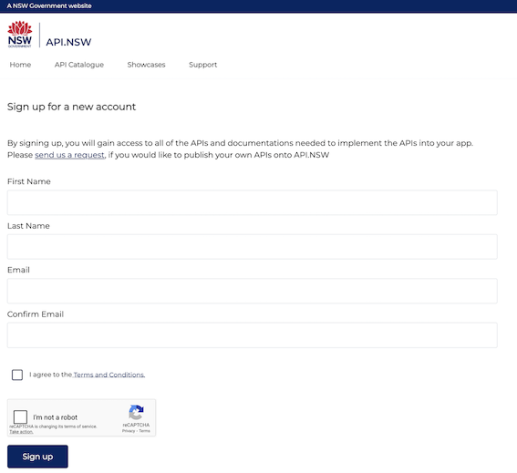
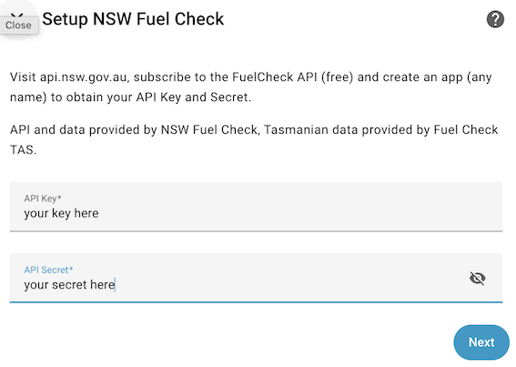
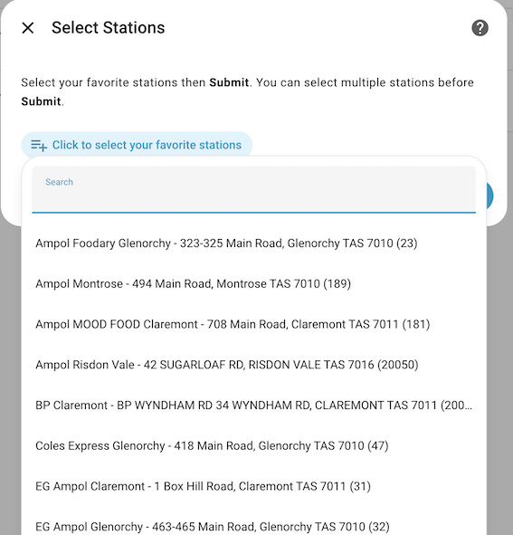
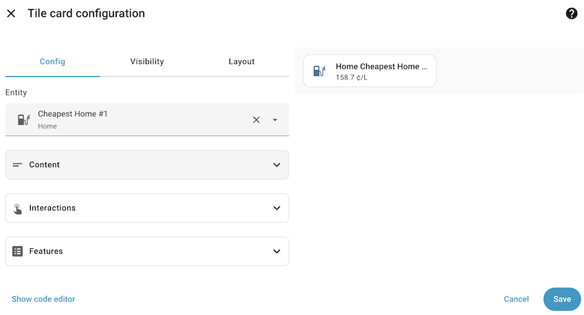
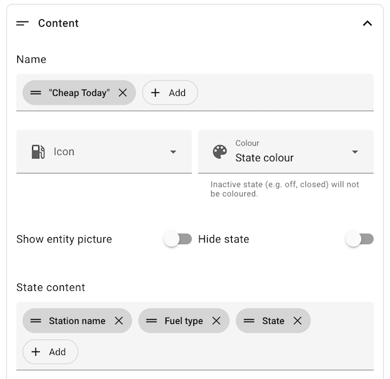
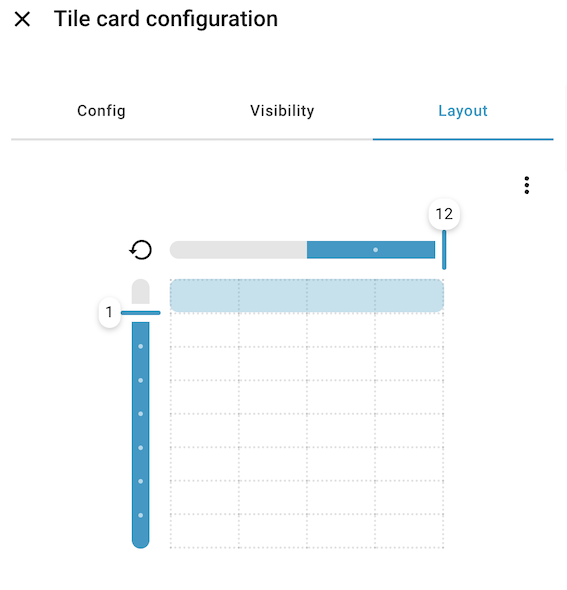
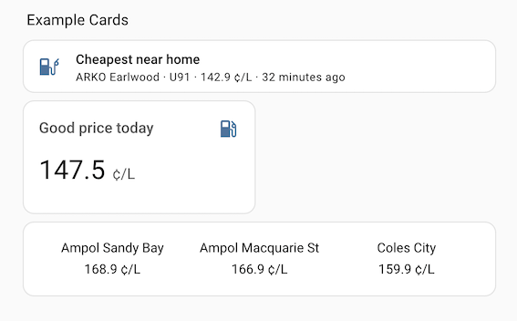
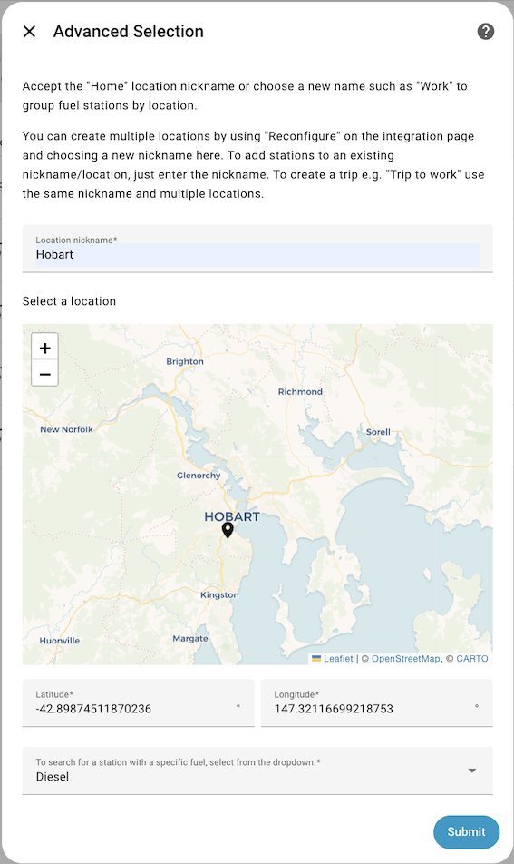
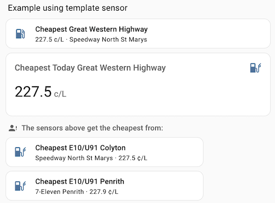

<!-----
title: NSW Fuel Check
description: Integration for the New South Wales Fuel Check API
ha_release: 2026.5
ha_iot_class: Cloud Polling
ha_codeowners:
  - '@bicycleboy'
ha_domain: nsw_tas_fuel_station
ha_integration_type: hub
related:
  - url: https://github.com/bicycleboy/nsw_fuel_tas_station
    title: Integration Source
  - url: https://https://github.com/bicycleboy/nsw-fuel-api-client
    title: API Client Source
---
-->

The **NSW Fuel Check** integration is used to integrate with the NSW Government API for Fuel Prices using official mandatory reporting data from NSW Fuel Check and FuelCheck - TAS.

This integration only supports Australian states NSW, the ACT and Tasmania.

Like weather integrations, the idea is not to replace the NSW Fuel Check App but give you a glance at prices as you visit your home assistant dashboard.

# Prerequisites

1. Live or travel in NSW, the ACT or Tasmania.
2. Visit api.nsw.gov.au.
3. Subscribe to the FuelCheck API and create an app to obtain your API Key and Secret. Signup is free. The site requires an email address but does not spam you.  When prompted to create and name your app it can have any name.  Make a note of the API Key and API Secret.

# Installation
Currently this is a custom integration, see [the readme](./README.md) for installation details.

# Configuration

## Home Zone

On the setup screen, enter your credentials.

Once you have validated your key and secret you will be prompted to select fuel stations from the list of stations near your home zone. These "favorite" stations assume we are creatures of habit and typically fill up at stations that are often the cheapest near us.

Select around 1 - 4 stations, more is hard to display neatly on a dashboard.  Also be aware the API does have rate limits if you choose 10's of stations.

Sensors will be created for each station you select.  In NSW and the ACT the default search is for Ethanol E10 and Unleaded U91. In Tasmania by default search is for Unleaded U91.

Click Submit.

## Adding Sensors to Your Dashboard

#### Selected Stations

Configure your dashboard cards as normal, the sensors will have names like "BP Rosedale U91", starting with the brand name. As station names can be long, you may want to configure a short custom name in cards that support it.

#### Cheapest Stations

Two additional sensors will be created:

- Cheapest Home #1
- Cheapest Home #2

The NSW Fuel Check API returns a balance between cheapest fuel and distance from your home zone. By default for NSW the integration looks for the lowest of U91 and E10 prices and for Tasmania the cheapest U91.

The **tile card** is a good choice for the cheapest sensors as the tile card provides access to the additional attributes of these sensors.  In the tile card configuration under the **Content - State Content** heading, use the **Add** button to add **Station name**, **Fuel type**, and **State**.  You may want to include Last Changed which is when the API reports the fuel price was last updated.

Since station names are often long you may wish to make the tile card full width.

The sensor card and glance card may also suit your dashboard, note that not all cards currently support additional attributes.

## Reconfigure and manage existing configuration

After initial setup, configuration changes are made from the integration entry's **Reconfigure** menu:

**Settings -> Devices & services -> NSW Fuel Check -> three dots -> Reconfigure**

The menu provides five paths:

### Add new location

Use **Add new location** to create another nickname/location and select its initial favorite stations. A nickname groups station sensors and the two cheapest-price sensors, for example "Home", "Work", or another location that is useful to you.

The location selector and search radius determine where FuelCheck searches. The selected fuel type determines the station list shown during configuration and the fuel searched by the cheapest sensors for that nickname/location.

You can also enter exclusion text to omit matching station names from the cheapest-price results, for example a members-only station you do not use.

### Add station to existing location

Use **Add station to existing location** when you want to add another favorite station to a location that is already configured.

First choose the existing location from the dropdown. Home Assistant device names are shown where available, so a renamed device such as "Petrol" can be selected without needing to know its original stored nickname.

Then choose a search location/radius and fuel type to find the station. These search choices are temporary and are used only to find the station; they do not change the existing location's saved coordinates, radius, cheapest-fuel type or exclusion text.

### Edit existing location settings

Use **Edit existing location settings** when you want to change an existing nickname/location without having to add another station.

You can change:

- saved location and search radius;
- cheapest-fuel search type;
- cheapest-station exclusion text.

The integration checks the proposed settings with FuelCheck before saving them. If the selected fuel, location, radius or exclusion text produces no matching prices, the change is not saved and the form explains what can be adjusted.

Changing these settings does not add or remove favorite stations.

### Manage configured stations

Use **Manage configured stations** to select a nickname/location and then one of its configured stations.

For the selected station you can:

- add a fuel type currently reported by FuelCheck for that station;
- remove an individual configured fuel type by removing its selected chip;
- remove the entire station from that nickname/location.

After a successful station change, the station list remains open so you can continue editing other stations in the same location.

If you remove the final configured station from a nickname/location, Home Assistant asks for confirmation before also removing the now-empty location device and its cheapest-price entities.

### Delete location

Use **Delete location** to remove an entire nickname/location, all of its configured favorite-station entities, and its cheapest-price entities. A confirmation screen is shown before deletion.

This also provides a cleanup path for an existing location that no longer contains any favorite stations.

# Data updates

The **NSW Fuel Check** integration polls data from the API twiced a day by default.

# Known limitations

The integration currently only supports New South Wales, the ACT and Tasmania (Australia).

Some fuel types such as EV can be selected but currently do not return any data.

Selecting less common fuel types may produce unexpected results, e.g. NSW stations included in Tasmania.

# Troubleshooting

## I cannot see the station name with the cheapest price, only "Cheapest Home 1"

#### Description

Most lovelace cards do not support the required additional attributes which hold the station name.

#### Resolution

Use a tile card as described under **Cheapest Stations** above.

## My Cheapest Home 2 sensor is unavailable

#### Description

No price is shown, only unavailable for the 2nd cheapest sensor.

#### Resolution

In some locations the NSW Fuel Check API may only return 1 station.  Try changing the location for the nickname repeatedly until you get a useful list of stations, these will likely be the stations that are "surveyed" for the cheapest fuel.

If a sensor consistently shows as unavailable you can disable the sensor using [Settings > Devices & services > Entities ](https://www.home-assistant.io/docs/configuration/customizing-devices/).

## I only see one station / I am not seeing the stations I expected in the select stations list

#### Description

Your stations list is missing stations you expected to see.

#### Resolution

This can be for a number of reasons. For example you searched to U91 but the station does not stock U91. Use **Reconfigure** and try different fuel types and locations. Try using different locations and radius settings to get all the stations you want. If you are still not seeing what you want, see "I want to know the cheapest price close to my usual routes" below. You can also turn on debugging as described in [the readme](./README.md) and check the logs for errors and details of the parameters sent to NSW Fuel Check.

## How do I remove a station or fuel type I no longer want?

#### Resolution

Open **Reconfigure -> Manage configured stations**, choose the nickname/location and then the station.

Remove an individual fuel by removing its selected fuel chip, or enable **Remove station** to remove the whole station. If it is the last station in the location, Home Assistant asks for confirmation before removing the now-empty location and its cheapest-price entities.

To remove a whole location directly, use **Reconfigure -> Delete location**.

## I just want 1 cheapest sensor / I want a sensor to cover my entire trip to work but only close to my route

#### Description

I want to know the cheapest price close to my usual routes, without cluttering my dashboard with many cards.

#### Resolution (Advanced)

1. This solution requires comfort with editing configuration.yaml.
2. Use the **Reconfigue** option with a small, say 5Km, radius to create multiple nicknames along your route(s).  Select just 1 station.
3. Edit your configuration.yaml and create a template sensor similar to [this example](./example_template_sensor.yaml).  You will of course need to change the sensor names to match yours or get your favorite AI to do it for you.
4. Restart HA.
5. Add the template sensor to your dashboard.  You can find example cards like the below using the template sensor [here](./example_card_template_sensor.yaml).
6. You may wish to disable any station entities created if you are not using them on your dashboard to avoid API rate limits.

## I am a Diesel/Premiun Petrol user, how do I find the cheapest?

#### Description

By default the cheapest sensors search for E10/U91.  Earlier releases only supported E10/U91 requiring an upgrade in HACS. Previous workarounds were limited to a finite set of chosen stations, whereas you will now see the cheapest stations found by NSW Fuel Check.

#### Resolution

Use **Reconfigure -> Edit existing location settings** to change the cheapest-fuel search type for an existing location without adding another station. Choose Premium Unleaded 95/98, Diesel, or another supported fuel. The integration validates the new selection against FuelCheck before saving it.

Use **Reconfigure -> Manage configured stations** if you also want to add or remove fuel types for individual favorite stations.

# Feedback
Feedback, ideas, requests, bugs all welcome and can be made [here](https://github.com/bicycleboy/nsw_tas_fuel_station/issues).
